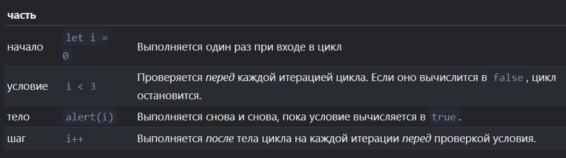

# Loops
Циклы служат для многократного повторения участка кода.

**Итерация** - одно выполнение тела цикла. 

## for

```javascript
for (начало; условие; шаг) {
  // ... тело цикла ...
}
```



## for in

*для объектов.

Используется для перебора всех свойств объекта.

Вывод всех свойств объекта user:

```javascript
let user = {
  name: "John",
  age: 30,
  isAdmin: true
};

for (let key in user) {
  // ключи
  alert( key );  // name, age, isAdmin
  // значения ключей
  alert( user[key] ); // John, 30, true
}
```
## for of

*для перебора элементов итерируемых объектов, таких как массивы, строки, наборы (Sets), карты (Maps) и т. д.  

Он обеспечивает удобный способ перебора значений в коллекции без необходимости работать с индексами.

```javascript
for (variable of iterable) {
  // код, который будет выполнен для каждого элемента
}
```

Здесь **variable** - переменная, которая будет использоваться для представления текущего элемента при каждой итерации цикла, а **iterable** - итерируемый объект, элементы которого нужно перебрать.


*не предоставляет доступа к номеру текущего элемента, только к его значению
## while

```javascript
while (condition) {
  // код
  // также называемый "телом цикла"
}
```

Код из тела цикла выполняется, пока условие condition истинно.
## do-while

Цикл сначала выполнит тело, а затем проверит условие condition, и пока его значение равно true, он будет выполняться снова и снова.

```javascript
do {
  // тело цикла
} while (condition);
```

**break** - специальная директива для прекращения выполнения цикла;

**continue** - директива, которая позволяет перейти к следующей итерации;

Например, цикл ниже использует continue, чтобы выводить только нечётные значения:

```javascript
for (let i = 0; i < 10; i++) {

  // если true, пропустить оставшуюся часть тела цикла
  if (i % 2 == 0) continue;

  alert(i); // 1, затем 3, 5, 7, 9
}
```

**Метка** - это идентификатор, предшествующий циклу, к которому необходимо вернуться. Используется для перехода к внешнему циклу из вложенного.

```javascript
outerLoop: for (var i = 0; i < 5; i++) {
  console.log('Внешний цикл: ' + i);
  
  innerLoop: for (var j = 0; j < 3; j++) {
    if (j === 1) {
      console.log('Переход к внешнему циклу');
      break outerLoop;
    }
    
    console.log('Внутренний цикл: ' + j);
  }
}
```